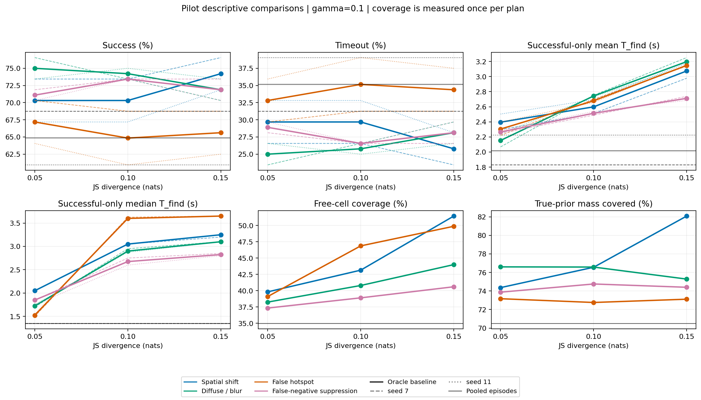
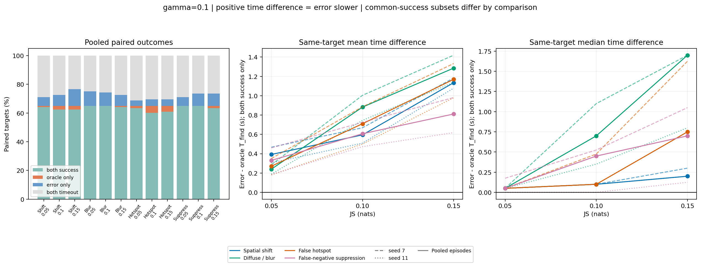
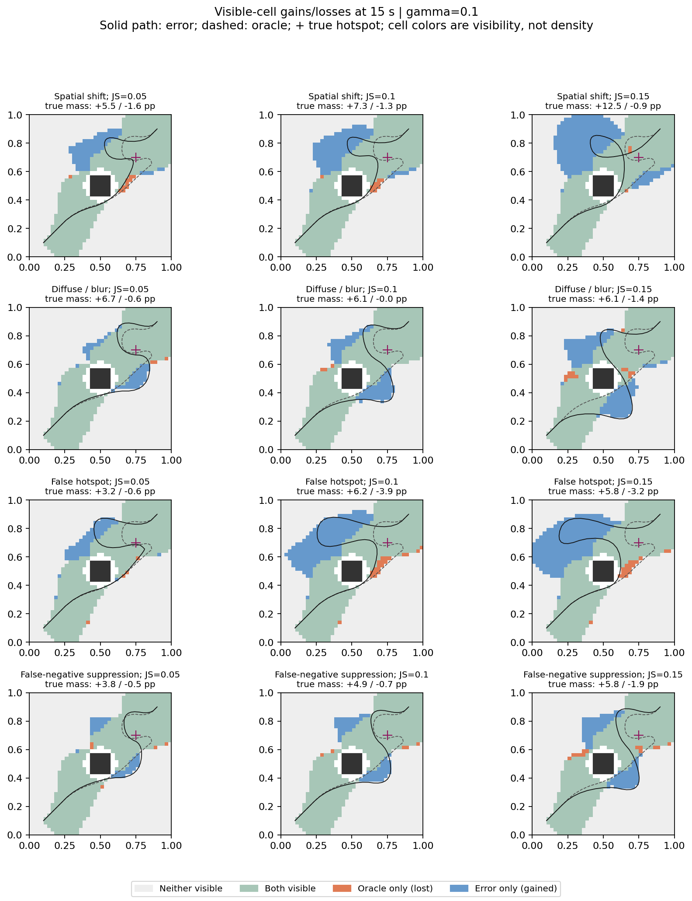
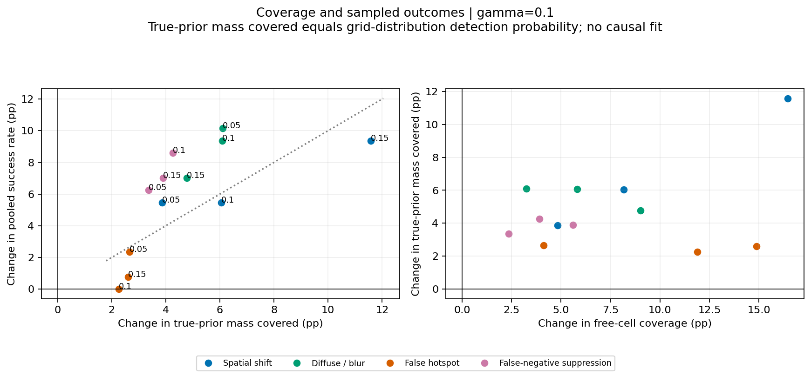
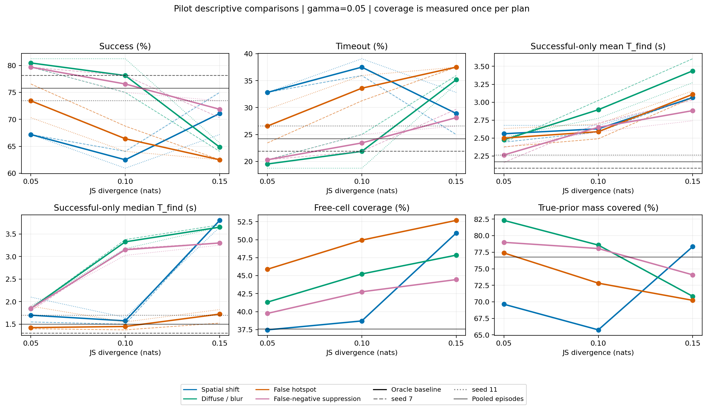
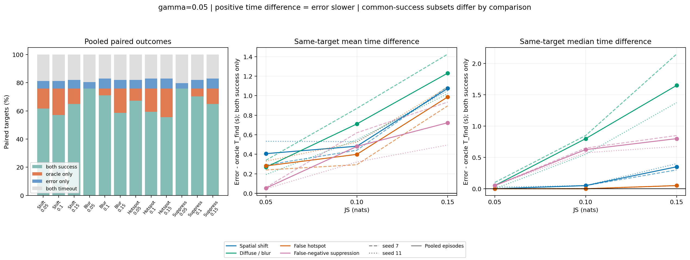
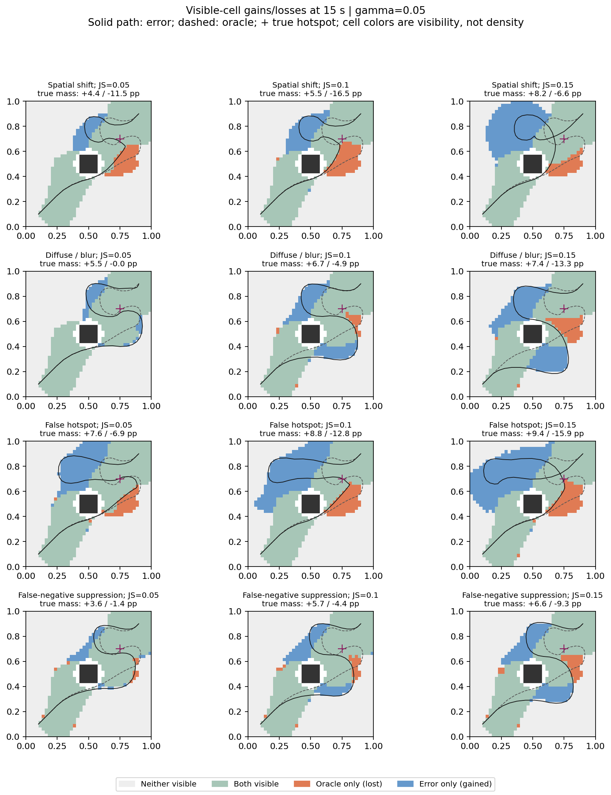
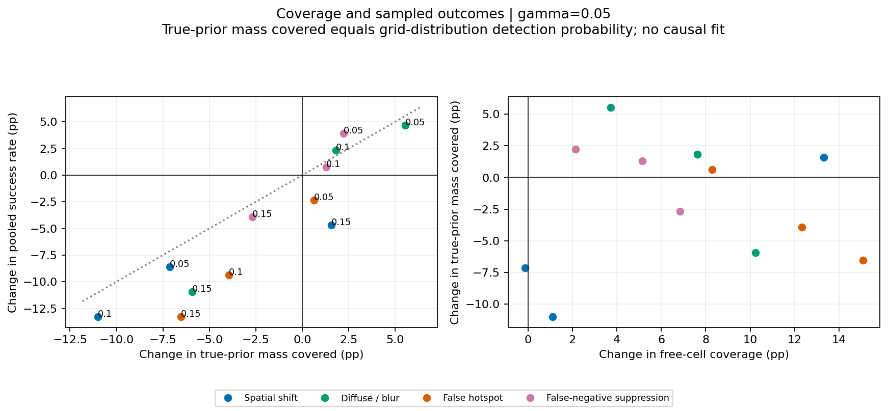

# Milestone 4 pilot analysis

This is a descriptive analysis of saved trajectories and paired targets.
No planner was imported or run. Four error families share JS levels 0.05, 0.10 and 0.15 nats.
The analysis verifies the saved calibration, episode summaries, pairings and every coverage time sample.

## How to read these results

- Each condition has 64 targets per seed (7 and 11); pooled results use all 128 raw episodes.
  Pooled successful-only means/medians are recomputed from detections, not averaged across seed summaries.
- Delta means error minus oracle. A positive success delta is a gain; a positive time delta is slower.
- Successful-only summaries can compare different target subsets. Paired timing uses only targets found
  by both policies, with its denominator reported; that common subset also changes across error comparisons.
- Coverage is measured once per deterministic plan. The two seeds are evaluation samples, not independent
  scenes or optimizer replicates. No confidence intervals, p-values or general family ranking are reported.
- On this fixed target grid with the ideal detector and shared observation times, true-prior mass covered
  equals the detection probability under the discrete true distribution. Agreement with sampled success
  is therefore an expected sampling relationship, not independent proof of a causal mediation mechanism.
- **Primary endpoints for this pilot and the proposed formal suite are the exact full-grid metrics**:
  exact detection probability (true-prior mass with finite first-visible time; identical to true-prior
  mass covered above) and its true-prior-weighted mean/median T_find, conditional on detection. Sampled
  successful-only mean/median and the 128-draw success rate are retained as a secondary, precision-sensitivity
  check against target-draw noise (see observation 6 and the protocol v2 draft's primary-endpoint section).
- **Uniform-weighted diagnostic**: the same exact full-grid computation reweighted by a uniform distribution
  over the supported free-cell mask instead of the true prior, applied to the same oracle-conditioned saved
  trajectories -- not a new planner run under a uniform prior. Its detection rate is exactly
  `visible_free_fraction` (the visited fraction of supported cells); its weighted mean/median T_find is new
  and isolates *where the trajectory physically went* from *how much true-prior probability mass it
  captured*. A true uniform-prior baseline would require planning a fresh trajectory under a uniform prior;
  that is deferred to the protocol v2 preflight/formal design, not computed here.
- **Paired outcomes are a 2x2 table** of (oracle succeeded/timed out) x (error-prior policy succeeded/timed
  out): `oracle_success_error_success_count`, `oracle_success_error_timeout_count`,
  `oracle_timeout_error_success_count`, `oracle_timeout_error_timeout_count` in the paired summary CSVs
  (equal to the legacy `both_success/oracle_only/error_only/both_timeout` columns, kept for compatibility).
- Paired timing now also reports p75/p90/p95/max of the both-success ΔT distribution and the ΔT>0/=0/<0
  proportions (not just counts), alongside the existing mean/median.
- `prior_entropy.csv` and the `trajectory_length`/`entropy_nats` columns in `mechanism_summary.csv` record
  discrete Shannon entropy (nats) of each calibrated prior and the physical path length of each planned
  trajectory (sum of consecutive node-to-node distances), for cross-reference against coverage and success
  in the same row.

## Observations in this pilot

1. **Compare the gamma strata separately.** For spatial shift at JS=0.10, pooled success
   differs from oracle by +5.47 percentage points at gamma=0.10,
   and -13.28 points at gamma=0.05.
   Both target seeds agree with their respective pooled contrast signs: True.
2. **Separate visible area from true probability.** For false hotspot at JS=0.15, gamma=0.05,
   free-cell coverage changes by +15.08 points, whereas true-prior
   mass covered changes by -6.54 points. Pooled success changes by
   -13.28 points. The maps show both new regions and lost regions.
3. **Inspect the JS response without imposing monotonicity.** For spatial
   shift at gamma=0.05, success across JS=0.05/0.10/0.15 is 67.19%/62.50%/71.09%.
4. **Common-success timing also changes.** Across the 24 pooled error-versus-oracle comparisons,
   mean paired time differences range from +0.053 to +1.286 seconds.
   Each comparison uses its own both-success subset; this is not a claim that every target is slower.
5. **Distribution-level coverage and sampled success are distinct.** Spatial shift at JS=0.15, gamma=0.05
   changes true-prior mass covered by +1.58 points while pooled sampled
   success changes by -4.69 points.
   These are different quantities: one integrates the fixed distribution, the other uses 128 draws.
   This motivates separating target-sampling uncertainty from scenario/geometry variation.
6. **True-prior- and uniform-weighted timing agree in sign but not in magnitude.** Across all 24 pooled error-versus-oracle mechanism rows (12 conditions x 2 gammas), the
   true-prior-weighted and uniform-weighted changes in mean T_find are both positive (slower) in 24 of 24 rows: this is not a sign-flip finding like observation 2's
   coverage/mass contrast. The true-prior-weighted change exceeds the uniform-weighted change in 23 of 24 rows -- e.g. for false hotspot at JS=0.15, gamma=0.05, the
   true-prior-weighted mean T_find changes by +0.991 s versus +0.592 s uniform-weighted (same trajectories, reweighted
   only by which cells were physically visited). The exception is false hotspot at JS=0.05, gamma=0.05, where the uniform-weighted change (+0.564 s) exceeds the true-prior-weighted change
   (+0.381 s). This is a descriptive pattern in this
   pilot's rows, not a mechanism claim.

## gamma = 0.1

Oracle: success 83/128 (64.84%), successful-only mean/median 2.016/1.350 s, free-cell coverage 34.99%, true-prior mass covered 70.51%.

| Family | JS | Success % | Delta success pp | Successful-only mean / median s | Both-success n | Paired mean / median delta s | Coverage % | True mass % |
|---|---:|---:|---:|---:|---:|---:|---:|---:|
| Spatial shift | 0.05 | 70.31 | +5.47 | 2.396 / 2.050 | 82 | 0.392 / 0.050 | 39.82 | 74.37 |
| Spatial shift | 0.1 | 70.31 | +5.47 | 2.599 / 3.050 | 80 | 0.595 / 0.100 | 43.15 | 76.56 |
| Spatial shift | 0.15 | 74.22 | +9.38 | 3.075 / 3.250 | 80 | 1.135 / 0.200 | 51.44 | 82.08 |
| Diffuse / blur | 0.05 | 75.00 | +10.16 | 2.154 / 1.725 | 83 | 0.240 / 0.050 | 38.25 | 76.60 |
| Diffuse / blur | 0.1 | 74.22 | +9.38 | 2.743 / 2.900 | 83 | 0.883 / 0.700 | 40.80 | 76.58 |
| Diffuse / blur | 0.15 | 71.88 | +7.03 | 3.198 / 3.100 | 82 | 1.286 / 1.700 | 43.99 | 75.29 |
| False hotspot | 0.05 | 67.19 | +2.34 | 2.305 / 1.525 | 81 | 0.270 / 0.050 | 39.10 | 73.17 |
| False hotspot | 0.1 | 64.84 | +0.00 | 2.680 / 3.600 | 77 | 0.710 / 0.100 | 46.87 | 72.76 |
| False hotspot | 0.15 | 65.62 | +0.78 | 3.148 / 3.650 | 78 | 1.170 / 0.750 | 49.87 | 73.12 |
| False-negative suppression | 0.05 | 71.09 | +6.25 | 2.266 / 1.850 | 83 | 0.331 / 0.050 | 37.34 | 73.87 |
| False-negative suppression | 0.1 | 73.44 | +8.59 | 2.514 / 2.675 | 83 | 0.607 / 0.450 | 38.90 | 74.76 |
| False-negative suppression | 0.15 | 71.88 | +7.03 | 2.712 / 2.825 | 81 | 0.811 / 0.700 | 40.60 | 74.40 |

**Exact full-grid diagnostics (primary endpoint, columns 3-5; uniform-weighted diagnostic, columns 6-8).**
Detection probability/rate is the true-prior (resp. uniform) mass with a finite first-visible time;
weighted mean/median T_find are conditional on that detection. Trajectory length is the summed
node-to-node path distance of the planned trajectory.

Oracle: exact detection 70.51%, exact weighted mean/median 1.978/1.350 s; uniform detection 34.99%, uniform weighted mean/median 1.637/1.100 s; trajectory length 1.563.

| Family | JS | Exact detect % | Exact weighted mean / median s | Uniform detect % | Uniform weighted mean / median s | Trajectory length | Delta length |
|---|---:|---:|---:|---:|---:|---:|---:|
| Spatial shift | 0.05 | 74.37 | 2.437 / 2.450 | 39.82 | 1.821 / 1.300 | 1.595 | +0.032 |
| Spatial shift | 0.1 | 76.56 | 2.674 / 3.100 | 43.15 | 1.911 / 1.450 | 1.651 | +0.088 |
| Spatial shift | 0.15 | 82.08 | 3.005 / 3.200 | 51.44 | 2.061 / 1.750 | 1.847 | +0.284 |
| Diffuse / blur | 0.05 | 76.60 | 2.232 / 1.850 | 38.25 | 1.756 / 1.250 | 1.668 | +0.105 |
| Diffuse / blur | 0.1 | 76.58 | 2.752 / 2.950 | 40.80 | 1.946 / 1.800 | 1.682 | +0.120 |
| Diffuse / blur | 0.15 | 75.29 | 3.216 / 3.100 | 43.99 | 2.130 / 2.150 | 1.752 | +0.189 |
| False hotspot | 0.05 | 73.17 | 2.246 / 1.450 | 39.10 | 1.820 / 1.200 | 1.894 | +0.332 |
| False hotspot | 0.1 | 72.76 | 2.709 / 3.600 | 46.87 | 1.936 / 1.650 | 2.122 | +0.559 |
| False hotspot | 0.15 | 73.12 | 3.021 / 3.650 | 49.87 | 2.022 / 1.850 | 2.139 | +0.576 |
| False-negative suppression | 0.05 | 73.87 | 2.308 / 1.950 | 37.34 | 1.755 / 1.250 | 1.459 | -0.104 |
| False-negative suppression | 0.1 | 74.76 | 2.483 / 2.750 | 38.90 | 1.817 / 1.550 | 1.529 | -0.034 |
| False-negative suppression | 0.15 | 74.40 | 2.678 / 2.850 | 40.60 | 1.892 / 1.800 | 1.609 | +0.046 |

**Paired discordant outcomes (2x2: oracle outcome x error-prior outcome) and both-success ΔT tails.**
ΔT = error T_find - oracle T_find on the common-success subset; positive is slower. Proportions use
the "oracle ok, error ok" (both-success) count from this same row as their denominator.

| Family | JS | Oracle ok, error ok | Oracle ok, error timeout | Oracle timeout, error ok | Both timeout | ΔT>0 % | ΔT=0 % | ΔT<0 % | p75 | p90 | p95 | max s |
|---|---:|---:|---:|---:|---:|---:|---:|---:|---:|---:|---:|---:|
| Spatial shift | 0.05 | 82 | 1 | 8 | 37 | 68.3 | 19.5 | 12.2 | 0.225 | 1.850 | 1.850 | 4.300 |
| Spatial shift | 0.1 | 80 | 3 | 10 | 35 | 76.2 | 13.8 | 10.0 | 1.563 | 1.900 | 2.017 | 4.600 |
| Spatial shift | 0.15 | 80 | 3 | 15 | 30 | 81.2 | 11.2 | 7.5 | 2.050 | 3.935 | 4.600 | 4.800 |
| Diffuse / blur | 0.05 | 83 | 0 | 13 | 32 | 56.6 | 26.5 | 16.9 | 0.500 | 0.740 | 1.650 | 1.800 |
| Diffuse / blur | 0.1 | 83 | 0 | 12 | 33 | 75.9 | 19.3 | 4.8 | 1.700 | 1.750 | 1.800 | 4.300 |
| Diffuse / blur | 0.15 | 82 | 1 | 10 | 35 | 87.8 | 11.0 | 1.2 | 1.900 | 2.000 | 3.720 | 4.350 |
| False hotspot | 0.05 | 81 | 2 | 5 | 40 | 65.4 | 23.5 | 11.1 | 0.300 | 0.550 | 2.050 | 4.300 |
| False hotspot | 0.1 | 77 | 6 | 6 | 39 | 77.9 | 10.4 | 11.7 | 2.150 | 2.400 | 2.500 | 2.500 |
| False hotspot | 0.15 | 78 | 5 | 6 | 39 | 84.6 | 9.0 | 6.4 | 2.350 | 2.500 | 2.550 | 2.650 |
| False-negative suppression | 0.05 | 83 | 0 | 8 | 37 | 50.6 | 19.3 | 30.1 | 0.400 | 1.500 | 1.545 | 4.300 |
| False-negative suppression | 0.1 | 83 | 0 | 11 | 34 | 56.6 | 15.7 | 27.7 | 1.400 | 1.590 | 1.600 | 4.300 |
| False-negative suppression | 0.15 | 81 | 2 | 11 | 34 | 64.2 | 9.9 | 25.9 | 1.600 | 1.700 | 1.750 | 4.300 |

## gamma = 0.05

Oracle: success 97/128 (75.78%), successful-only mean/median 2.170/1.500 s, free-cell coverage 37.60%, true-prior mass covered 76.77%.

| Family | JS | Success % | Delta success pp | Successful-only mean / median s | Both-success n | Paired mean / median delta s | Coverage % | True mass % |
|---|---:|---:|---:|---:|---:|---:|---:|---:|
| Spatial shift | 0.05 | 67.19 | -8.59 | 2.561 / 1.700 | 79 | 0.406 / 0.000 | 37.47 | 69.64 |
| Spatial shift | 0.1 | 62.50 | -13.28 | 2.630 / 1.575 | 73 | 0.482 / 0.050 | 38.71 | 65.76 |
| Spatial shift | 0.15 | 71.09 | -4.69 | 3.064 / 3.800 | 83 | 1.075 / 0.350 | 50.91 | 78.34 |
| Diffuse / blur | 0.05 | 80.47 | +4.69 | 2.477 / 1.850 | 97 | 0.267 / 0.050 | 41.32 | 82.31 |
| Diffuse / blur | 0.1 | 78.12 | +2.34 | 2.895 / 3.325 | 91 | 0.710 / 0.800 | 45.23 | 78.58 |
| Diffuse / blur | 0.15 | 64.84 | -10.94 | 3.437 / 3.650 | 75 | 1.231 / 1.650 | 47.85 | 70.84 |
| False hotspot | 0.05 | 73.44 | -2.34 | 2.501 / 1.425 | 86 | 0.281 / 0.000 | 45.89 | 77.39 |
| False hotspot | 0.1 | 66.41 | -9.38 | 2.590 / 1.450 | 76 | 0.399 / 0.000 | 49.93 | 72.82 |
| False hotspot | 0.15 | 62.50 | -13.28 | 3.110 / 1.725 | 71 | 0.987 / 0.050 | 52.68 | 70.23 |
| False-negative suppression | 0.05 | 79.69 | +3.91 | 2.266 / 1.850 | 97 | 0.053 / 0.050 | 39.75 | 78.99 |
| False-negative suppression | 0.1 | 76.56 | +0.78 | 2.651 / 3.150 | 90 | 0.480 / 0.625 | 42.75 | 78.05 |
| False-negative suppression | 0.15 | 71.88 | -3.91 | 2.883 / 3.300 | 83 | 0.723 / 0.800 | 44.45 | 74.08 |

**Exact full-grid diagnostics (primary endpoint, columns 3-5; uniform-weighted diagnostic, columns 6-8).**
Detection probability/rate is the true-prior (resp. uniform) mass with a finite first-visible time;
weighted mean/median T_find are conditional on that detection. Trajectory length is the summed
node-to-node path distance of the planned trajectory.

Oracle: exact detection 76.77%, exact weighted mean/median 2.041/1.450 s; uniform detection 37.60%, uniform weighted mean/median 1.729/1.150 s; trajectory length 1.878.

| Family | JS | Exact detect % | Exact weighted mean / median s | Uniform detect % | Uniform weighted mean / median s | Trajectory length | Delta length |
|---|---:|---:|---:|---:|---:|---:|---:|
| Spatial shift | 0.05 | 69.64 | 2.422 / 1.500 | 37.47 | 1.828 / 1.200 | 1.860 | -0.018 |
| Spatial shift | 0.1 | 65.76 | 2.596 / 1.650 | 38.71 | 1.861 / 1.300 | 1.905 | +0.026 |
| Spatial shift | 0.15 | 78.34 | 2.956 / 3.750 | 50.91 | 2.088 / 1.850 | 2.078 | +0.200 |
| Diffuse / blur | 0.05 | 82.31 | 2.487 / 2.000 | 41.32 | 1.919 / 1.300 | 2.174 | +0.296 |
| Diffuse / blur | 0.1 | 78.58 | 2.899 / 3.400 | 45.23 | 2.041 / 1.850 | 2.175 | +0.297 |
| Diffuse / blur | 0.15 | 70.84 | 3.315 / 3.650 | 47.85 | 2.182 / 2.450 | 2.184 | +0.306 |
| False hotspot | 0.05 | 77.39 | 2.422 / 1.400 | 45.89 | 2.293 / 1.450 | 2.469 | +0.591 |
| False hotspot | 0.1 | 72.82 | 2.686 / 1.450 | 49.93 | 2.295 / 2.200 | 2.486 | +0.608 |
| False hotspot | 0.15 | 70.23 | 3.032 / 1.800 | 52.68 | 2.321 / 2.150 | 2.639 | +0.761 |
| False-negative suppression | 0.05 | 78.99 | 2.364 / 1.900 | 39.75 | 1.832 / 1.350 | 1.892 | +0.014 |
| False-negative suppression | 0.1 | 78.05 | 2.652 / 3.150 | 42.75 | 1.936 / 1.700 | 1.962 | +0.084 |
| False-negative suppression | 0.15 | 74.08 | 2.897 / 3.350 | 44.45 | 2.007 / 1.900 | 2.036 | +0.158 |

**Paired discordant outcomes (2x2: oracle outcome x error-prior outcome) and both-success ΔT tails.**
ΔT = error T_find - oracle T_find on the common-success subset; positive is slower. Proportions use
the "oracle ok, error ok" (both-success) count from this same row as their denominator.

| Family | JS | Oracle ok, error ok | Oracle ok, error timeout | Oracle timeout, error ok | Both timeout | ΔT>0 % | ΔT=0 % | ΔT<0 % | p75 | p90 | p95 | max s |
|---|---:|---:|---:|---:|---:|---:|---:|---:|---:|---:|---:|---:|
| Spatial shift | 0.05 | 79 | 18 | 7 | 24 | 46.8 | 31.6 | 21.5 | 0.100 | 2.440 | 2.700 | 4.750 |
| Spatial shift | 0.1 | 73 | 24 | 7 | 24 | 61.6 | 19.2 | 19.2 | 0.250 | 2.730 | 2.770 | 4.750 |
| Spatial shift | 0.15 | 83 | 14 | 8 | 23 | 73.5 | 14.5 | 12.0 | 2.575 | 2.750 | 2.750 | 3.650 |
| Diffuse / blur | 0.05 | 97 | 0 | 6 | 25 | 50.5 | 21.6 | 27.8 | 0.750 | 1.320 | 2.150 | 4.750 |
| Diffuse / blur | 0.1 | 91 | 6 | 9 | 22 | 62.6 | 12.1 | 25.3 | 1.900 | 2.450 | 2.600 | 4.750 |
| Diffuse / blur | 0.15 | 75 | 22 | 8 | 23 | 69.3 | 12.0 | 18.7 | 2.400 | 2.550 | 2.615 | 2.650 |
| False hotspot | 0.05 | 86 | 11 | 8 | 23 | 33.7 | 37.2 | 29.1 | 0.087 | 1.000 | 2.737 | 4.750 |
| False hotspot | 0.1 | 76 | 21 | 9 | 22 | 38.2 | 34.2 | 27.6 | 0.350 | 2.425 | 4.750 | 5.000 |
| False hotspot | 0.15 | 71 | 26 | 9 | 22 | 60.6 | 19.7 | 19.7 | 2.575 | 4.750 | 5.000 | 5.000 |
| False-negative suppression | 0.05 | 97 | 0 | 5 | 26 | 50.5 | 11.3 | 38.1 | 0.500 | 1.370 | 1.770 | 2.050 |
| False-negative suppression | 0.1 | 90 | 7 | 8 | 23 | 63.3 | 5.6 | 31.1 | 1.488 | 2.160 | 2.300 | 2.450 |
| False-negative suppression | 0.15 | 83 | 14 | 9 | 22 | 67.5 | 6.0 | 26.5 | 2.050 | 2.390 | 2.445 | 2.550 |

## Mechanism diagnostics

`mechanism_summary.csv` separates newly visible cells from cells lost relative to oracle, weighting each
by the fixed true prior. It also splits mass first detected before versus at/after terminal-pose arrival.
Arrival is `(N-1)*tf/N`, not `tf`, under the frozen execution rule. The latter mass is incremental
coverage during the terminal hold, not a counterfactual estimate of the benefit of holding.

`visibility_replay.npz` retains first-visible times (infinity for unseen cells), allowing the spatial
gain/loss maps and decomposition to be checked without planning. The replay matches all saved coverage
time samples and episode detections. Area gain alone need not imply probability-mass gain.

## Seed sensitivity

`metrics_by_seed.csv` and `paired_summary_by_seed.csv` retain separate seed outcomes. The plots show
seed 7 dashed, seed 11 dotted and pooled solid. With only two target seeds, their spread is descriptive
and is not an uncertainty estimate across scenes or error geometries.

## Prior entropy

Discrete Shannon entropy (nats, natural log, matching the JS units used elsewhere) of each calibrated
prior and the true/oracle prior, from `results/calibration/priors.npz`. Entropy is a property of the
prior alone and does not vary with gamma; `prior_entropy.csv` and the `entropy_nats` column of
`mechanism_summary.csv` carry the same values for cross-reference against coverage and success.

| Prior | Family | JS | Entropy (nats) |
|---|---|---:|---:|
| oracle | oracle | 0.0 | 6.5372 |
| spatial_shift_js_0.05 | Spatial shift | 0.05 | 6.5524 |
| spatial_shift_js_0.1 | Spatial shift | 0.1 | 6.5562 |
| spatial_shift_js_0.15 | Spatial shift | 0.15 | 6.5595 |
| diffuse_blur_js_0.05 | Diffuse / blur | 0.05 | 6.9313 |
| diffuse_blur_js_0.1 | Diffuse / blur | 0.1 | 7.2085 |
| diffuse_blur_js_0.15 | Diffuse / blur | 0.15 | 7.3203 |
| false_hotspot_js_0.05 | False hotspot | 0.05 | 6.7900 |
| false_hotspot_js_0.1 | False hotspot | 0.1 | 6.7985 |
| false_hotspot_js_0.15 | False hotspot | 0.15 | 6.7491 |
| false_negative_suppression_js_0.05 | False-negative suppression | 0.05 | 7.0483 |
| false_negative_suppression_js_0.1 | False-negative suppression | 0.1 | 7.1450 |
| false_negative_suppression_js_0.15 | False-negative suppression | 0.15 | 7.1647 |

## Limits and next experiment

These comparisons establish condition-specific behavior under the frozen planner, camera and budget.
They do not establish universal error-family ordering, or coverage as the only pathway affecting timing.
The exact full-grid detection probability and weighted T_find are the declared primary endpoints for the
proposed formal suite (see the protocol v2 draft's primary-endpoint section); sampled successful-only
statistics remain a secondary precision-sensitivity check, motivated directly by observation 6 above.
The next deliverable is the [protocol v2 draft](../../PROTOCOL_V2_DRAFT.md): a prespecified scenario and
error-geometry set, per-block JS calibration, and paired contrasts with scenes as the unit of generalization.
Its feasibility and precision checks must precede freezing the formal experiment manifest.
