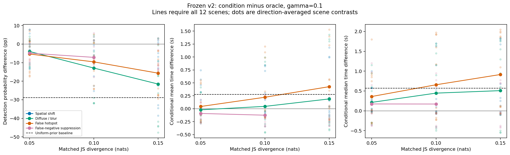
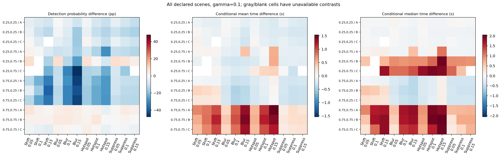
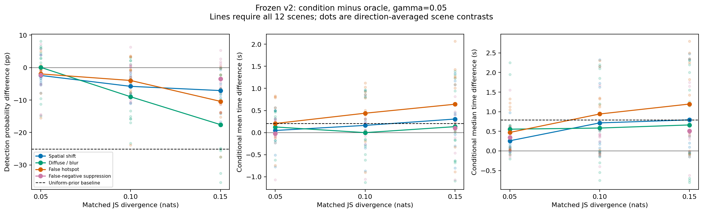
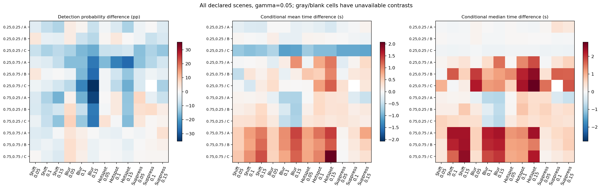
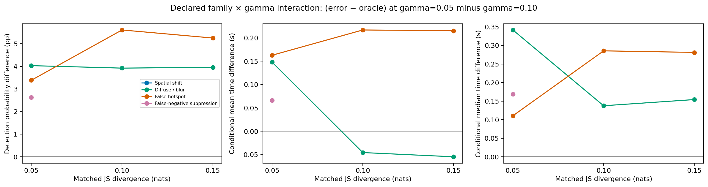
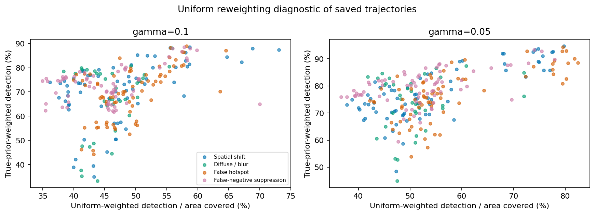
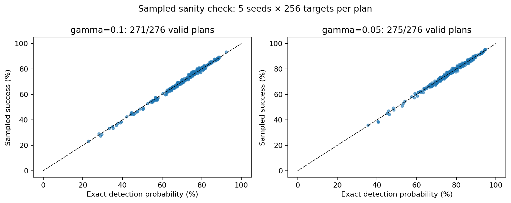

# Frozen Protocol v2 formal results

Execution records: **552/552**. Valid plans: **546/552**. Invalid/interrupted/exception plans: **6/552**. Artifact audit: **passed**.

**The execution ledger is complete, but the matched valid suite is incomplete.** Failed plans are planner failures, not search timeouts. Conditional comparisons below retain only valid pairs; no family ranking is made.

Design: 12 scenes × 2 gamma values × 23 distinct plans. Oracle, blur, and uniform-prior baseline plans are shared across direction blocks, not independent replications.

Exact full-grid detection probability and true-prior-weighted conditional mean/median detection time are primary. These values integrate the frozen supported target grid and contain no target-sampling noise. They are not continuous-space ground truth. Conditional detection times describe detected mass; faster times alone do not establish better search when detection probability changes.

Each contrast is left minus right. The two direction contrasts are averaged inside a scene; the 12 declared scenes then receive equal weight. A missing direction leaves that scene's average unavailable. Timing summaries additionally require detected mass in both plans. Every available denominator and retained scene set is saved in the CSV tables. A mean over fewer than 12 scenes is explicitly conditional; figures with finite-suite mean lines require all 12 scenes. No population confidence intervals, significance tests, or post-hoc ranking are reported for this designed finite suite.

## Primary exact-grid contrasts

Mean differences and scene ranges below follow the frozen direction-then-scene aggregation. The N column is valid scenes / 12; mean-time and median-time columns each state their own available scene count. Positive probability differences favor the left condition; positive timing differences mean slower conditional detection.

### gamma=0.1

| Left − right | JS (nats) | N | Δ detection (pp) [scene range] | Δ mean T (s), N | Δ median T (s), N |
|---|---:|---:|---:|---:|---:|
| Uniform-prior baseline − Oracle | NA | 12/12 | -28.880 [-64.101, 2.919] | 0.278, 12/12 | 0.571, 12/12 |
| Spatial shift − Oracle | 0.05 | 11/12 | -1.950 [-13.349, 7.724] | 0.198, 11/12 | 0.305, 11/12 |
| Diffuse / blur − Oracle | 0.05 | 12/12 | -3.960 [-13.141, 7.837] | -0.021, 12/12 | 0.213, 12/12 |
| False hotspot − Oracle | 0.05 | 12/12 | -5.338 [-17.465, 6.975] | 0.043, 12/12 | 0.360, 12/12 |
| False-negative suppression − Oracle | 0.05 | 12/12 | -4.886 [-11.302, 7.874] | -0.091, 12/12 | 0.173, 12/12 |
| Spatial shift − Diffuse / blur | 0.05 | 11/12 | 1.304 [-3.866, 11.943] | 0.209, 11/12 | 0.177, 11/12 |
| Spatial shift − False hotspot | 0.05 | 11/12 | 2.536 [-4.078, 12.507] | 0.163, 11/12 | 0.075, 11/12 |
| Spatial shift − False-negative suppression | 0.05 | 11/12 | 2.653 [-3.410, 12.743] | 0.299, 11/12 | 0.225, 11/12 |
| Diffuse / blur − False hotspot | 0.05 | 12/12 | 1.378 [-5.868, 5.106] | -0.064, 12/12 | -0.148, 12/12 |
| Diffuse / blur − False-negative suppression | 0.05 | 12/12 | 0.926 [-3.728, 8.971] | 0.071, 12/12 | 0.040, 12/12 |
| False hotspot − False-negative suppression | 0.05 | 12/12 | -0.452 [-7.200, 6.414] | 0.134, 12/12 | 0.188, 12/12 |
| Spatial shift − Oracle | 0.10 | 10/12 | -8.800 [-25.301, 2.176] | 0.262, 10/12 | 0.520, 10/12 |
| Diffuse / blur − Oracle | 0.10 | 12/12 | -12.909 [-31.852, 4.845] | 0.045, 12/12 | 0.446, 12/12 |
| False hotspot − Oracle | 0.10 | 12/12 | -9.581 [-24.208, 5.280] | 0.222, 12/12 | 0.656, 12/12 |
| False-negative suppression − Oracle | 0.10 | 12/12 | -7.152 [-17.747, 5.987] | -0.125, 12/12 | 0.171, 12/12 |
| Spatial shift − Diffuse / blur | 0.10 | 10/12 | 2.168 [-4.434, 14.366] | 0.158, 10/12 | 0.190, 10/12 |
| Spatial shift − False hotspot | 0.10 | 10/12 | 1.405 [-4.208, 13.795] | 0.026, 10/12 | 0.043, 10/12 |
| Spatial shift − False-negative suppression | 0.10 | 10/12 | -1.394 [-12.098, 11.519] | 0.364, 10/12 | 0.470, 10/12 |
| Diffuse / blur − False hotspot | 0.10 | 12/12 | -3.328 [-18.300, 4.957] | -0.176, 12/12 | -0.210, 12/12 |
| Diffuse / blur − False-negative suppression | 0.10 | 12/12 | -5.758 [-19.369, 6.996] | 0.170, 12/12 | 0.275, 12/12 |
| False hotspot − False-negative suppression | 0.10 | 12/12 | -2.430 [-11.577, 4.195] | 0.347, 12/12 | 0.485, 12/12 |
| Spatial shift − Oracle | 0.15 | 11/12 | -15.855 [-38.572, 1.988] | 0.296, 11/12 | 0.752, 11/12 |
| Diffuse / blur − Oracle | 0.15 | 12/12 | -21.539 [-47.717, 3.164] | 0.189, 12/12 | 0.508, 12/12 |
| False hotspot − Oracle | 0.15 | 12/12 | -15.661 [-29.376, -0.091] | 0.426, 12/12 | 0.915, 12/12 |
| False-negative suppression − Oracle | 0.15 | 11/12 | -7.804 [-14.941, 3.320] | -0.112, 11/12 | 0.150, 11/12 |
| Spatial shift − Diffuse / blur | 0.15 | 11/12 | 6.075 [-4.336, 25.294] | 0.063, 11/12 | 0.189, 11/12 |
| Spatial shift − False hotspot | 0.15 | 11/12 | 0.185 [-11.277, 22.524] | -0.186, 11/12 | -0.252, 11/12 |
| Spatial shift − False-negative suppression | 0.15 | 10/12 | -7.635 [-25.572, 6.750] | 0.424, 10/12 | 0.480, 10/12 |
| Diffuse / blur − False hotspot | 0.15 | 12/12 | -5.878 [-23.874, 13.250] | -0.237, 12/12 | -0.406, 12/12 |
| Diffuse / blur − False-negative suppression | 0.15 | 11/12 | -11.355 [-32.786, 3.199] | 0.336, 11/12 | 0.286, 11/12 |
| False hotspot − False-negative suppression | 0.15 | 11/12 | -7.113 [-15.828, 0.779] | 0.545, 11/12 | 0.677, 11/12 |

### gamma=0.05

| Left − right | JS (nats) | N | Δ detection (pp) [scene range] | Δ mean T (s), N | Δ median T (s), N |
|---|---:|---:|---:|---:|---:|
| Uniform-prior baseline − Oracle | NA | 12/12 | -25.122 [-48.560, 0.424] | 0.204, 12/12 | 0.788, 12/12 |
| Spatial shift − Oracle | 0.05 | 12/12 | -2.420 [-7.836, 3.987] | 0.048, 12/12 | 0.258, 12/12 |
| Diffuse / blur − Oracle | 0.05 | 12/12 | 0.072 [-14.915, 8.150] | 0.127, 12/12 | 0.554, 12/12 |
| False hotspot − Oracle | 0.05 | 12/12 | -1.953 [-15.527, 5.065] | 0.206, 12/12 | 0.471, 12/12 |
| False-negative suppression − Oracle | 0.05 | 12/12 | -2.259 [-14.689, 7.212] | -0.025, 12/12 | 0.342, 12/12 |
| Spatial shift − Diffuse / blur | 0.05 | 12/12 | -2.492 [-11.813, 11.628] | -0.079, 12/12 | -0.296, 12/12 |
| Spatial shift − False hotspot | 0.05 | 12/12 | -0.467 [-7.214, 12.239] | -0.158, 12/12 | -0.212, 12/12 |
| Spatial shift − False-negative suppression | 0.05 | 12/12 | -0.161 [-12.347, 11.117] | 0.073, 12/12 | -0.083, 12/12 |
| Diffuse / blur − False hotspot | 0.05 | 12/12 | 2.025 [-8.714, 7.116] | -0.078, 12/12 | 0.083, 12/12 |
| Diffuse / blur − False-negative suppression | 0.05 | 12/12 | 2.331 [-5.688, 6.218] | 0.152, 12/12 | 0.212, 12/12 |
| False hotspot − False-negative suppression | 0.05 | 12/12 | 0.306 [-7.128, 6.785] | 0.231, 12/12 | 0.129, 12/12 |
| Spatial shift − Oracle | 0.10 | 12/12 | -5.780 [-11.072, -1.069] | 0.163, 12/12 | 0.715, 12/12 |
| Diffuse / blur − Oracle | 0.10 | 12/12 | -8.987 [-23.331, 3.016] | -0.000, 12/12 | 0.583, 12/12 |
| False hotspot − Oracle | 0.10 | 12/12 | -3.971 [-23.830, 3.608] | 0.439, 12/12 | 0.942, 12/12 |
| False-negative suppression − Oracle | 0.10 | 11/12 | -2.197 [-10.823, 6.365] | -0.010, 11/12 | 0.350, 11/12 |
| Spatial shift − Diffuse / blur | 0.10 | 12/12 | 3.207 [-9.525, 19.807] | 0.163, 12/12 | 0.131, 12/12 |
| Spatial shift − False hotspot | 0.10 | 12/12 | -1.809 [-14.153, 19.159] | -0.276, 12/12 | -0.227, 12/12 |
| Spatial shift − False-negative suppression | 0.10 | 11/12 | -3.788 [-15.105, 5.477] | 0.220, 11/12 | 0.432, 11/12 |
| Diffuse / blur − False hotspot | 0.10 | 12/12 | -5.016 [-20.323, 8.743] | -0.439, 12/12 | -0.358, 12/12 |
| Diffuse / blur − False-negative suppression | 0.10 | 11/12 | -5.486 [-14.408, 2.069] | 0.008, 11/12 | 0.177, 11/12 |
| False hotspot − False-negative suppression | 0.10 | 11/12 | -1.290 [-13.682, 11.388] | 0.411, 11/12 | 0.468, 11/12 |
| Spatial shift − Oracle | 0.15 | 12/12 | -7.082 [-16.677, -0.155] | 0.307, 12/12 | 0.792, 12/12 |
| Diffuse / blur − Oracle | 0.15 | 12/12 | -17.579 [-35.343, -0.167] | 0.135, 12/12 | 0.663, 12/12 |
| False hotspot − Oracle | 0.15 | 12/12 | -10.408 [-27.480, 0.262] | 0.642, 12/12 | 1.196, 12/12 |
| False-negative suppression − Oracle | 0.15 | 12/12 | -3.428 [-13.724, 5.305] | 0.108, 12/12 | 0.508, 12/12 |
| Spatial shift − Diffuse / blur | 0.15 | 12/12 | 10.497 [-2.758, 28.900] | 0.172, 12/12 | 0.129, 12/12 |
| Spatial shift − False hotspot | 0.15 | 12/12 | 3.325 [-3.805, 19.095] | -0.335, 12/12 | -0.404, 12/12 |
| Spatial shift − False-negative suppression | 0.15 | 12/12 | -3.654 [-15.365, 4.920] | 0.199, 12/12 | 0.283, 12/12 |
| Diffuse / blur − False hotspot | 0.15 | 12/12 | -7.172 [-18.649, 3.255] | -0.507, 12/12 | -0.533, 12/12 |
| Diffuse / blur − False-negative suppression | 0.15 | 12/12 | -14.151 [-27.569, -2.909] | 0.027, 12/12 | 0.154, 12/12 |
| False hotspot − False-negative suppression | 0.15 | 12/12 | -6.980 [-20.873, 7.351] | 0.534, 12/12 | 0.688, 12/12 |

## Declared family × gamma interaction

Interaction = (left − right at gamma=0.05) − (left − right at gamma=0.10), paired within the same scene before equal-scene averaging. Both gamma values must be available. The complete interaction table includes all six family pairs and the uniform-prior baseline.

| Error family | JS | Δ probability interaction (pp) | N | Δ mean-time interaction (s) | N |
|---|---:|---:|---:|---:|---:|
| Spatial shift | 0.05 | -0.550 | 11/12 | -0.142 | 11/12 |
| Diffuse / blur | 0.05 | 4.032 | 12/12 | 0.148 | 12/12 |
| False hotspot | 0.05 | 3.385 | 12/12 | 0.163 | 12/12 |
| False-negative suppression | 0.05 | 2.626 | 12/12 | 0.066 | 12/12 |
| Spatial shift | 0.1 | 2.323 | 10/12 | -0.058 | 10/12 |
| Diffuse / blur | 0.1 | 3.922 | 12/12 | -0.046 | 12/12 |
| False hotspot | 0.1 | 5.610 | 12/12 | 0.217 | 12/12 |
| False-negative suppression | 0.1 | 3.991 | 11/12 | 0.096 | 11/12 |
| Spatial shift | 0.15 | 8.962 | 11/12 | 0.111 | 11/12 |
| Diffuse / blur | 0.15 | 3.960 | 12/12 | -0.055 | 12/12 |
| False hotspot | 0.15 | 5.253 | 12/12 | 0.215 | 12/12 |
| False-negative suppression | 0.15 | 5.098 | 11/12 | 0.208 | 11/12 |

## Uniform-weighted diagnostic

Every saved valid trajectory also has uniform-weighted detection probability and conditional timing. This reweights the same trajectory over free cells and is a diagnostic, not an independent ranking metric. The separately planned uniform-prior baseline appears in the primary contrasts above.

## Sampled precision-sensitivity check

Seeds 100–104, 256 targets per seed, 1,280 draws per scene/condition. Targets are paired by (scene_id, seed, episode) across priors, directions, levels and gamma. Successful-only summaries pool raw detections within each plan; they never average seed medians. The paired tables include oracle-success/error-success, oracle-success/error-timeout, oracle-timeout/error-success, and both-timeout counts; both-success ΔT mean, median, p75/p90/p95/max and negative/zero/positive proportions use the explicit common-success denominator.

- gamma=0.1: 271/276 valid plans; median / maximum absolute sampled–exact probability discrepancy: 0.698 / 2.666 percentage points. This is a sampling diagnostic, not a formal effect or ranking.
- gamma=0.05: 275/276 valid plans; median / maximum absolute sampled–exact probability discrepancy: 0.649 / 2.586 percentage points. This is a sampling diagnostic, not a formal effect or ranking.

## Validity and provenance

Frozen protocol: `m4-controlled-prior-v2-frozen`; frozen M3 commit: `6e0bce5977f15c0d2686aa1ba09b8c7fcc7ee547`.

All attempted conditions remain in `condition_metrics.csv`; invalid search metrics are null. No solver retry, per-condition substitution, condition deletion, or protocol revision is part of this analysis. See the formal suite's `formal_audit.json` for condition, frozen-source/prior hashes, pairing and validity verification.

| Failed plan | Status |
|---|---|
| `cx0.25_cy0.25_layoutC__gamma_0.1__spatial_shift_y_js_0.15` | invalid |
| `cx0.25_cy0.75_layoutB__gamma_0.1__spatial_shift_y_js_0.1` | invalid |
| `cx0.25_cy0.75_layoutC__gamma_0.1__spatial_shift_x_js_0.1` | invalid |
| `cx0.25_cy0.75_layoutC__gamma_0.1__spatial_shift_y_js_0.05` | invalid |
| `cx0.25_cy0.75_layoutC__gamma_0.1__false_negative_suppression_y_js_0.15` | invalid |
| `cx0.25_cy0.75_layoutC__gamma_0.05__false_negative_suppression_y_js_0.1` | invalid |

## Saved outputs

- `condition_metrics.csv`: every distinct planned condition, exact primary and uniform diagnostic metrics, coverage, entropy, trajectory length, validity.
- `primary_block_contrasts.csv`: all oracle/error, uniform/oracle and six family-pair contrasts at each declared block.
- `primary_scene_contrasts.csv`, `primary_contrast_summary.csv`: direction-then-scene aggregation, ranges, signs, denominators and retained scene IDs.
- `gamma_interactions_by_scene.csv`, `gamma_interaction_summary.csv`: the declared paired family × gamma contrasts.
- `sampled_sanity_check.csv`: each seed and pooled sampled metrics beside exact values.
- `sampled_oracle_pairs.csv`: per-block 2×2 counts and paired common-success ΔT tails.
- `figures/`: PNG and PDF figures. Raw trajectories, solver diagnostics, grid first-detection distributions and sampled episodes remain in the formal suite's per-plan directories.

No post-hoc tuning or protocol changes were performed. Further changes require a separately frozen revision.
